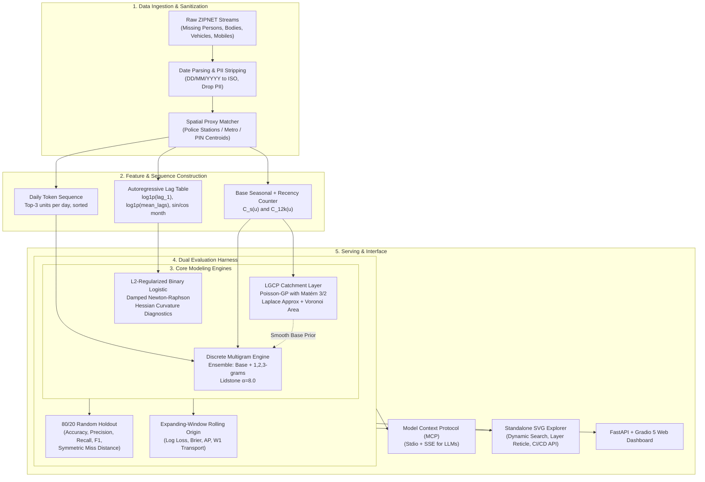
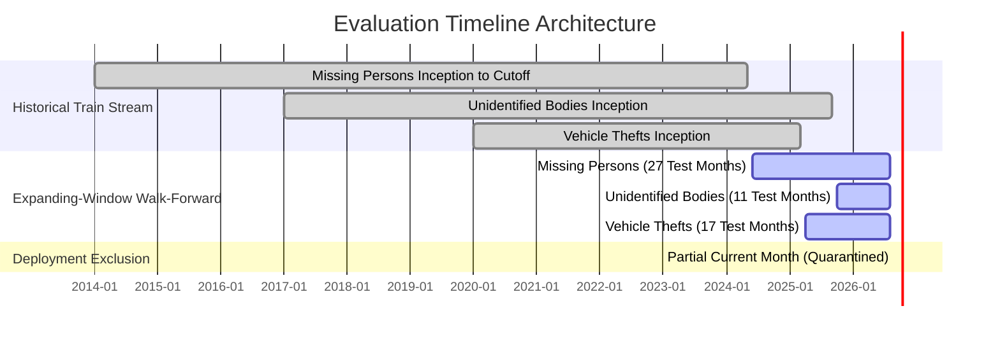

# Algorithmic Approaches, Dataset Taxonomy, and Architecture Review

**Project:** OCULON / DelhiHotspots_ML  
**Repository Path:** `/Users/abhyuday/Desktop/DelhiHotspots_ML`  
**Evaluation Cutoff:** September 2026 (Live As-Of Benchmark: `2026-09-28`)  
**Scope:** In-depth technical specification of datasets, data hygiene protocols, algorithmic techniques, benchmark formulations, spatial transport metrics, serving infrastructure (MCP / Web), and structured architectural upgrade vectors.

---

## Table of Contents
1. [Repository Scan & Structural Overview](#1-repository-scan--structural-overview)
2. [Dataset Taxonomy, Types & Qualities](#2-dataset-taxonomy-types--qualities)
   - 2.1 [Missing Persons (`missing_persons`)](#21-missing-persons-missing_persons)
   - 2.2 [Unidentified Dead Bodies (`unidentified_bodies`)](#22-unidentified-dead-bodies-unidentified_bodies)
   - 2.3 [Stolen Vehicles (`stolen_vehicles`)](#23-stolen-vehicles-stolen_vehicles)
   - 2.4 [Missing Mobiles (`missing_mobiles`)](#24-missing-mobiles-missing_mobiles)
   - 2.5 [Spatial Reference Catalogues & Vector Geometry Layers](#25-spatial-reference-catalogues--vector-geometry-layers)
   - 2.6 [Data Quality, Sanitation & Privacy Guarantees](#26-data-quality-sanitation--privacy-guarantees)
3. [Algorithmic Approaches & Mathematical Formulations](#3-algorithmic-approaches--mathematical-formulations)
   - 3.1 [Discrete Spatial-Temporal Multigram Model](#31-discrete-spatial-temporal-multigram-model)
   - 3.2 [Log-Gaussian Cox Process (LGCP) Catchment-Integration Layer](#32-log-gaussian-cox-process-lgcp-catchment-integration-layer)
   - 3.3 [Regularized Binary Logistic Hotspot Model & Hessian Curvature Analysis](#33-regularized-binary-logistic-hotspot-model--hessian-curvature-analysis)
   - 3.4 [Spatial Distance & Optimal Transport Formulations](#34-spatial-distance--optimal-transport-formulations)
4. [Dataset-to-Algorithm Mapping Matrix](#4-dataset-to-algorithm-mapping-matrix)
5. [Validation Protocol & Empirical Benchmark Results](#5-validation-protocol--empirical-benchmark-results)
   - 5.1 [Dual Evaluation Paradigms: Random Holdout vs. Expanding-Window Rolling Origin](#51-dual-evaluation-paradigms-random-holdout-vs-expanding-window-rolling-origin)
   - 5.2 [Consolidated Quantitative Metrics](#52-consolidated-quantitative-metrics)
6. [Interactive Serving & Model Context Protocol (MCP) Architecture](#6-interactive-serving--model-context-protocol-mcp-architecture)
7. [Structural Gap Analysis & Recommended Upgrade Blueprint](#7-structural-gap-analysis--recommended-upgrade-blueprint)
   - 7.1 [Algorithmic & Statistical Upgrades](#71-algorithmic--statistical-upgrades)
   - 7.2 [Spatial Feature Engineering Enhancements](#72-spatial-feature-engineering-enhancements)
   - 7.3 [Codebase & Production Architecture Refactoring](#73-codebase--production-architecture-refactoring)

---

## 1. Repository Scan & Structural Overview

The repository consists of a complete production-grade spatial-temporal machine learning library, dataset store, vector geometry cache, interactive visualization explorer, and Model Context Protocol (MCP) server.

```
DelhiHotspots_ML/
├── app/                               # Local static dashboards & standalone maps
│   ├── four_dataset_hotspot_explorer.html
│   └── individual_maps/               # Individual SVG interactive maps
├── config/
│   └── model_config.json              # Hyperparameters, seeds, and weights
├── data/
│   ├── processed/                     # Sanitized, PII-stripped event records & master JSON store
│   │   ├── missing_persons_events.csv
│   │   ├── unidentified_bodies_events.csv
│   │   └── four_dataset_complete_store.json
│   ├── raw/                           # Raw staging guidelines (PII quarantine)
│   └── reference/                     # Administrative boundaries & station catalogues
│       ├── delhi_police_stations.geojson
│       ├── delhi_metro_stations.geojson
│       ├── delhi_metro_lines.geojson
│       ├── delhi_road_lines.geojson
│       ├── delhi_railway_lines.geojson
│       ├── delhi_pincode_polygons.geojson
│       ├── delhi_political_wards.geojson
│       ├── delhi_election_districts.geojson
│       ├── police_unit_catalogue.json
│       ├── metro_unit_catalogue.json
│       └── pin_unit_catalogue.json
├── dist_pages/                        # GitHub Pages distribution artifacts
├── docs/                              # Mathematical definitions & methodology guides
├── hf_space/                          # Hugging Face Spaces deployment mirror (Gradio + FastAPI)
├── models/                            # Stored model weights, payloads & Hessian diagnostics
│   ├── missing_persons/
│   ├── stolen_vehicles/
│   └── unidentified_bodies/
├── reports/                           # Rolling-origin & holdout validation reports
│   ├── dataset_comparison.json
│   ├── four_dataset_forecast_all_units.csv
│   ├── four_dataset_forecast_top_seven.csv
│   ├── missing_persons/
│   ├── mobiles_and_unidentified_bodies/
│   ├── rolling_origin/
│   └── stolen_vehicles/
├── scripts/                           # Map builders, CI/CD integrators & test harnesses
│   ├── dynamic_map_cicd_upgrade.py
│   ├── deploy_to_hf.sh
│   └── deploy_to_pages.sh
└── src/
    ├── delhi_hotspots/                # Core ML training, evaluation & inference library
    │   ├── augment_stolen_from_localities.py
    │   ├── build_four_dataset_hotspot_dashboard.py
    │   ├── build_metro_station_hotspots.py
    │   ├── build_random_hotspot_model.py
    │   ├── build_spatial_method_comparison.py
    │   ├── build_spatiotemporal_map.py
    │   ├── evaluate_rolling_origin.py
    │   ├── lgcp_layer.py
    │   ├── mcp_server.py
    │   ├── prepare_hotspot_train_test.py
    │   ├── prepare_temporal_events.py
    │   ├── train_missing_persons_multigram.py
    │   ├── train_mobiles_and_dead_bodies_multigram.py
    │   └── train_stolen_vehicle_multigram.py
    └── oculon/                        # Packaged distribution (PyPI module)
```

---

## 2. Dataset Taxonomy, Types & Qualities

### 2.1 Missing Persons (`missing_persons`)
* **Primary Source:** ZIPNET (Zonal Integrated Police Network) portal incident streams.
* **Volume:** 112,516 raw records; 107,707 usable date rows; 104,235 spatially mapped events.
* **Temporal Span:** 2014-01 through 2026-08 (135 observed calendar months; 134 complete months).
* **Target Feature:** Event count per police station jurisdiction per month.
* **Spatial Resolution:** Point proxy at police station coordinates ($(\phi, \lambda)$).
* **Attributes Utilized:** `DateFrom`, `PoliceStation`, `District`, `TracingStatus`.
* **Qualities & Edge Cases:**
  * Dates in non-standard format (`DD/MM/YYYY`) or missing: 765 rows.
  * Out-of-bounds/placeholder dates (pre-2000 like `01/01/1900`): 4,044 rows.
  * Name ambiguities / historical spelling drifts (`KAPSHERA` vs `KAPASHERA`, `MAYURVIHARPH1` vs `MAYURVIHARPHI`): 3,472 records lacked verified jurisdictional coordinates and were excluded from spatial training to prevent synthetic coordinate fabrication.
  * Status breakdown: 37,781 traced, 66,454 untraced.

### 2.2 Unidentified Dead Bodies (`unidentified_bodies`)
* **Primary Source:** ZIPNET Unidentified Dead Bodies registry.
* **Volume:** 13,334 raw records; 12,726 usable date rows; 9,892 spatially mapped events.
* **Temporal Span:** 2017-01 through 2026-08.
* **Target Feature:** Event recovery count per police station jurisdiction per month.
* **Spatial Resolution:** Station reference proxy (representing reporting station jurisdiction; not exact recovery GPS).
* **Attributes Utilized:** `Date`, `PoliceStation`, `District`, `Gender`, `AgeRange`.
* **Qualities & Edge Cases:**
  * Severe spatial sparsity: Low incident density per station-month compared to vehicle theft or missing persons.
  * Unmapped dates / station rows: 2,834 records had ambiguous hospital or district names without definitive station assignments.

### 2.3 Stolen Vehicles (`stolen_vehicles`)
* **Primary Source:** Delhi Police e-FIR / ZIPNET motor vehicle theft reports.
* **Volume:** 114,753 raw records; 114,573 usable date rows; 26,352 spatially resolved records across postal codes and transit nodes.
* **Temporal Span:** Multi-year sequence (17 rolling test months: `2025-04` to `2026-08`).
* **Spatial Resolution:** Dual spatial representation:
  1. **PIN Centroid Model:** 95 distinct Delhi postal PIN polygons/centroids.
  2. **Nearest Metro Station Model:** 233 Delhi Metro stations assigned via Haversine great-circle distance from incident locality.
* **Attributes Utilized:** `Stolen Date Clean`, `Stolen From Latitude`, `Stolen From Longitude`, `Stolen From PIN Code`, `Stolen From Locality Match Status`.
* **Qualities & Edge Cases:**
  * Raw FIR theft descriptions frequently contain noisy free-text ("Near pillar 142", "Outside market gate").
  * Handled via two-tier locality enrichment (`augment_stolen_from_localities.py`): unambiguous locality matching mapped to postal office directory or explicit 6-digit postal code.
  * Strict spatial bounding box filter: $27.8^\circ \le \phi \le 29.5^\circ$, $76.5^\circ \le \lambda \le 77.8^\circ$.

### 2.4 Missing Mobiles (`missing_mobiles`)
* **Primary Source:** Delhi Police Lost Report / ZIPNET lost mobile registrations.
* **Volume:** 1,602 usable dated rows.
* **Target Feature:** Aggregate temporal time-series trend over calendar months.
* **Spatial Resolution:** **Non-spatial** (No physical incident coordinates or verified station tags in source).
* **Qualities & Strict Architectural Rule:** Rather than fabricating speculative GPS coordinates, the system treats missing mobiles strictly as a temporal baseline to prevent spatial hallucination in public safety interfaces.

### 2.5 Spatial Reference Catalogues & Vector Geometry Layers
The system integrates an authoritative set of static geospatial catalogues (`data/reference/`):
* **Police Unit Catalogue (`police_unit_catalogue.json`):** 210 official Delhi police stations with standardized keys, English names, district associations, and WGS84 coordinates.
* **Metro Unit Catalogue (`metro_unit_catalogue.json`):** 233 Delhi Metro transit stations across all active lines.
* **PIN Unit Catalogue (`pin_unit_catalogue.json`):** 95 postal delivery zone centroids.
* **Vector Overlays:** Topologically cleaned GeoJSON layers for Election Districts (11 districts), Political Wards (272 MCD wards), Road Lines, Metro Lines, Railway Lines, and Pincode Polygons.

### 2.6 Data Quality, Sanitation & Privacy Guarantees
1. **PII Removal (Zero-Trust Privacy):** All victim names, complainant contact details, vehicle registration numbers, IMEI numbers, and home addresses are discarded during ingestion. Only $(d_i, u_i)$ pairs (`date`, `unit_id`) are propagated to feature tables.
2. **Deterministic Deduplication & Sorting:** Source events are sorted strictly by `(date, unit_id)` before training sequence generation.
3. **Temporal Sanity Filter:** Exclusion of dates preceding `2000-01-01` and future-dated records beyond the evaluation `as_of` date.

---

## 3. Algorithmic Approaches & Mathematical Formulations



### 3.1 Discrete Spatial-Temporal Multigram Model
The foundational hotspot ranker implemented in `train_missing_persons_multigram.py` and shared across datasets.

#### A. Daily Location Token Sequence
To convert event logs into a time-ordered spatial language without introducing arbitrary row-order bias, event counts are aggregated by calendar date. For each date $t$, the top $\le 3$ active spatial units with the highest event volume are appended as tokens:
$$z_t = \operatorname{Top3}\Big(\big\{ (u, c_{t,u}) \mid c_{t,u} > 0 \big\}\Big), \quad \text{ordered by } (-c_{t,u}, u)$$
The master sequence is the concatenated stream $Z = (z_1, z_2, \dots, z_T)$.

#### B. Seasonal-Recency Base Distribution $B(u)$
Let $s \in \{1, \dots, 12\}$ be the target calendar month. The historical events are partitioned into:
* $C_s(u)$: Events occurring at unit $u$ during calendar month $s$ across all preceding years.
* $C_{12k}(u)$: Events occurring at unit $u$ across the most recent 12,000 historical events.

The blended raw count weight is:
$$r(u) = 0.60 \cdot C_s(u) + 0.40 \cdot C_{12k}(u)$$

With $N$ candidate catalogue units, the smoothed base prior probability is:
$$B(u) = \frac{r(u) + 0.5}{\sum_{v=1}^N r(v) + 0.5 N}$$

#### C. Higher-Order Conditional $n$-Gram Transitions
For history orders $n \in \{1, 2, 3\}$, let $h_n = (z_{T-n+1}, \dots, z_T)$ be the trailing spatial history context.
The empirical transition count is:
$$c_n(u \mid h_n) = \sum_{i=n}^{T-1} \mathbb{I}\big(Z_{i-n:i} = h_n \land Z_{i+1} = u\big), \qquad C_n(h_n) = \sum_{v=1}^N c_n(v \mid h_n)$$

To avoid zero-frequency collapse, Lidstone smoothing with strength $\alpha = 8.0$ backs off to the base prior $B(u)$:
$$G_n(u \mid h_n) = \frac{c_n(u \mid h_n) + \alpha B(u)}{C_n(h_n) + \alpha}$$
If the exact context $h_n$ has not been observed in history ($C_n(h_n) = 0$), $G_n(u \mid h_n)$ gracefully reduces to $B(u)$.

#### D. Ensemble Score Normalization
The predicted score $S(u)$ is a linear convex combination:
$$S(u) = \frac{0.25 B(u) + 0.20 G_1(u \mid h_1) + 0.25 G_2(u \mid h_2) + 0.30 G_3(u \mid h_3)}{\sum_{v=1}^N \Big[ 0.25 B(v) + 0.20 G_1(v \mid h_1) + 0.25 G_2(v \mid h_2) + 0.30 G_3(v \mid h_3) \Big]}$$

#### E. Hotspot Quantile Selection
Given active observed units $A_m$ in target month $m$, the hotspot threshold fraction is $q = 0.10$ ($10\%$ top tier):
$$k = \max\big(1, \lceil q \cdot |A_m| \rceil\big)$$
* **Actual Hotspots:** The $k$ units with the largest observed test-month incident counts.
* **Predicted Hotspots:** The $k$ units with the highest model scores $S(u)$ in the catalogue.

---

### 3.2 Log-Gaussian Cox Process (LGCP) Catchment-Integration Layer
Implemented in `src/delhi_hotspots/lgcp_layer.py`. Replaces the uniform Lidstone smoothing prior with a spatially continuous, geostatistically principled prior over police station Voronoi catchments.

#### A. Mathematical Formulation
Let $\mathcal{D} \subset \mathbb{R}^2$ represent the spatial domain of Delhi. The incident point pattern is governed by an intensity field $\lambda(s) = \exp(b + f(s))$, where $f(s)$ is a continuous Gaussian Process:
$$f \sim \mathcal{GP}\big(0, k_{\text{Matérn } 3/2}(d)\big)$$
$$k_{\text{Matérn } 3/2}(d) = \sigma^2 \left(1 + \frac{\sqrt{3}d}{\ell}\right) \exp\left(-\frac{\sqrt{3}d}{\ell}\right)$$
where $d = \|s_i - s_j\|_2$ is the Euclidean distance in local projected kilometers, $\ell$ is the spatial correlation lengthscale, and $\sigma^2$ is the latent field variance.

#### B. Catchment Discretization & Voronoi Integration
Because police reports are aggregated at discrete station proxies $\{s_u\}_{u=1}^N$, each station is assigned a Voronoi catchment area $a_u$ computed via fine-grid Monte Carlo integration (grid cell $0.4 \text{ km}$, maximum bounding radius $7.0 \text{ km}$ to prevent edge boundary explosion):
$$a_u = \int_{\mathcal{V}_u} ds$$
The conditional observed counts $y_u$ follow an overdispersed Poisson likelihood with temperature scale $\tau$:
$$\tilde{y}_u = \frac{y_u}{\tau}, \qquad \tilde{y}_u \mid f_u \sim \text{Poisson}\big(a_u \exp(b + f_u)\big)$$
where $b = \log \left(\frac{\sum_u \tilde{y}_u}{\sum_u a_u}\right)$ is the baseline log-intensity offset.

#### C. Laplace Posterior Approximation (Rasmussen & Williams Alg. 3.1)
The unnormalized log-posterior over the latent vector $\mathbf{f} \in \mathbb{R}^N$ is:
$$\Psi(\mathbf{f}) = \sum_{u=1}^N \Big[ \tilde{y}_u (\log a_u + b + f_u) - a_u \exp(b + f_u) \Big] - \frac{1}{2} \mathbf{f}^T K^{-1} \mathbf{f}$$
Iterative Newton-Raphson with Cholesky factorization and step-halving determines the posterior mode $\hat{\mathbf{f}}$:
$$W = \operatorname{diag}\big(a_u \exp(b + \hat{f}_u)\big), \qquad B = I + W^{1/2} K W^{1/2}, \qquad L = \operatorname{Cholesky}(B)$$
$$\operatorname{Var}(f_u) = K_{uu} - \sum_{j} [L^{-1} W^{1/2} K]_{ju}^2$$

#### D. Catchment Integral Predictive Probability Measure
The posterior predictive intensity incorporates the log-normal mean correction:
$$\mathbb{E}[\exp(f_u)] = \exp\left(\hat{f}_u + \frac{1}{2} \operatorname{Var}(f_u)\right)$$
Multiplying by catchment area $a_u$ yields the total expected incident mass over the jurisdiction:
$$M(u) = a_u \exp\left(\hat{f}_u + \frac{1}{2} \operatorname{Var}(f_u)\right), \qquad p_{\text{LGCP}}(u) = \frac{M(u)}{\sum_{v=1}^N M(v)}$$
Stations with zero historical events inherit smooth probability mass from adjacent geographical neighbours rather than arbitrary global constants.

---

### 3.3 Regularized Binary Logistic Hotspot Model & Hessian Curvature Analysis
Implemented in `src/delhi_hotspots/build_spatial_method_comparison.py` for comparative benchmarking against the multigram ranker.

#### A. Feature Matrix Construction
For each spatial unit $u$ and month $m$, feature vector $\mathbf{x}_{u,m} \in \mathbb{R}^{N + 6}$ encodes:
1. Spatial unit one-hot indicator: $\mathbf{e}_u \in \{0, 1\}^N$.
2. Cyclic seasonal harmonics: $\sin(2\pi (s-1)/12)$ and $\cos(2\pi (s-1)/12)$.
3. Capped linear time trend: $\min(1.0, \max(0.0, (m - m_0) / 48))$.
4. 1-month lag count: $\log(1 + c_{m-1, u})$.
5. 3-month moving average count: $\log(1 + \frac{1}{3} \sum_{k=1}^3 c_{m-k, u})$.
6. Unpenalized intercept term: $x_0 = 1.0$.

#### B. Objective & Damped Newton-Raphson Optimization
Binary label $y_{u,m} \in \{0, 1\}$ indicates whether unit $u$ was in the top 10% hotspots in month $m$.
$$p_i = \sigma(\mathbf{x}_i^T \mathbf{w}) = \frac{1}{1 + e^{-\mathbf{x}_i^T \mathbf{w}}}$$
$$J(\mathbf{w}) = \frac{1}{n} \sum_{i=1}^n \Big[ \log(1 + e^{\mathbf{x}_i^T \mathbf{w}}) - y_i \mathbf{x}_i^T \mathbf{w} \Big] + \frac{\lambda}{2} \mathbf{w}^T P \mathbf{w}$$
where $\lambda = 0.08$, and $P = \operatorname{diag}(1, \dots, 1, 0)$ leaves the intercept unpenalized.

The gradient $\mathbf{g}$ and Hessian $H$ are:
$$\mathbf{g} = \nabla J(\mathbf{w}) = \frac{1}{n} X^T (\mathbf{p} - \mathbf{y}) + \lambda P \mathbf{w}$$
$$H = \nabla^2 J(\mathbf{w}) = \frac{1}{n} X^T D X + \lambda P, \qquad D = \operatorname{diag}\big(p_i (1 - p_i)\big)$$
Updates proceed via Newton steps $\mathbf{w}_{t+1} = \mathbf{w}_t - \alpha H^{-1} \mathbf{g}$ with backtracking line search ($\alpha \leftarrow 0.5 \alpha$) until $\|\alpha H^{-1} \mathbf{g}\|_\infty < 10^{-6}$.

#### C. Hessian Diagnostics
Stored in `models/stolen_vehicles/*_logistic_hessian.csv`. Condition numbers, trace, and minimum eigenvalues are evaluated to inspect feature collinearity and parameter stability.

---

### 3.4 Spatial Distance & Optimal Transport Formulations

#### A. Symmetric Mean Nearest-Neighbor Miss Distance ($D_{\text{sym}}$)
Used in baseline holdout reports. For actual hotspot coordinates $A$ and predicted hotspot coordinates $P$:
$$D_{\text{sym}}(A, P) = \frac{1}{2} \left[ \frac{1}{|A|} \sum_{a \in A} \min_{p \in P} d_H(a, p) + \frac{1}{|P|} \sum_{p \in P} \min_{a \in A} d_H(p, a) \right]$$
where $d_H(a, p)$ is the Haversine great-circle distance with Earth radius $R = 6,371.0088 \text{ km}$:
$$d_H = 2 R \arcsin\left(\sqrt{\sin^2\left(\frac{\Delta \phi}{2}\right) + \cos\phi_1 \cos\phi_2 \sin^2\left(\frac{\Delta \lambda}{2}\right)}\right)$$

#### B. Discrete 1-Wasserstein Earth Mover's Distance ($W_1$)
Implemented in `src/delhi_hotspots/build_spatial_method_comparison.py` via exact minimum-cost maximum-flow over local projected Cartesian coordinates:
$$x = R(\lambda - \lambda_0) \cos\phi_0, \qquad y = R(\phi - \phi_0)$$
For predicted unit mass distribution $\mathbf{p}$ and observed held-out mass distribution $\mathbf{q}$:
$$W_1(\mathbf{p}, \mathbf{q}) = \min_{\pi_{ij} \ge 0} \sum_{i=1}^N \sum_{j=1}^N \pi_{ij} \sqrt{(x_i - x_j)^2 + (y_i - y_j)^2}$$
$$\text{subject to} \quad \sum_{j=1}^N \pi_{ij} = p_i, \quad \sum_{i=1}^N \pi_{ij} = q_j$$
Solved using successive shortest path with node potentials (Dijkstra + Fibonacci heap). Avoids Sinkhorn entropic blurring and outputs exact transport cost in meters/kilometers.

---

## 4. Dataset-to-Algorithm Mapping Matrix

| Dataset | Spatial Proxy Representation | Primary Algorithmic Technique | Smoothing / Regularization | Evaluation Paradigm | Primary Benchmark Metrics |
| :--- | :--- | :--- | :--- | :--- | :--- |
| **Missing Persons** | 210 Delhi Police Stations (193 active mapped) | Discrete Spatio-Temporal Multigram + LGCP Layer | Lidstone ($\alpha=8.0$) & Matérn 3/2 GP ($\tau=30.0$) | Dual: 80/20 Holdout & Expanding-Window (27 mos) | F1: **0.523**, MAP: **0.537**, Log Loss: **4.99**, $W_1$: **1.23 km** |
| **Unidentified Dead Bodies** | 210 Delhi Police Stations (177 active mapped) | Discrete Spatio-Temporal Multigram | Seasonal/Recent Blend + Lidstone Backoff | Dual: 80/20 Holdout & Expanding-Window (11 mos) | F1: **0.517**, MAP: **0.549**, Log Loss: **4.74**, $W_1$: **2.10 km** |
| **Stolen Vehicles (PIN Centroid)** | 95 Postal PIN Delivery Centroids | Multigram & L2 Logistic ($N+6$ dim) | Damped Newton $\lambda=0.08$, Lidstone $\alpha=8.0$ | Dual: 80/20 Holdout & Expanding-Window (17 mos) | F1: **0.573**, MAP: **0.635**, Log Loss: **4.02**, $W_1$: **2.00 km** |
| **Stolen Vehicles (Nearest Metro)** | 233 Delhi Metro Stations | Multigram & L2 Logistic ($N+6$ dim) | Damped Newton $\lambda=0.08$, Lidstone $\alpha=8.0$ | Dual: 80/20 Holdout & Expanding-Window (17 mos) | F1: **0.515**, MAP: **0.644**, Log Loss: **3.90**, $W_1$: **1.69 km** |
| **Missing Mobiles** | Virtual Reporting Node (No physical coordinates) | Non-Spatial Time-Series Trend Aggregator | None (Strictly non-spatial to prevent hallucination) | Row-level 80/20 temporal split | Monthly Event Counts, Rate of Change |

---

## 5. Validation Protocol & Empirical Benchmark Results

### 5.1 Dual Evaluation Paradigms: Random Holdout vs. Expanding-Window Rolling Origin



1. **Baseline 80/20 Random Split:** Randomly shuffles historical records across the entire timeline (80% train / 20% test). Standard academic baseline, but susceptible to temporal data leakage because future events inform past predictions.
2. **Expanding-Window Rolling Origin (Walk-Forward Validation):**
   * Reserves the latest $20\%$ of complete calendar months as the test horizon.
   * For every test month $m$, training history is strictly restricted to dates $t < \text{YYYY-MM-01}$.
   * Partial current month (`2026-09`) is quarantined and excluded from scoring.
   * Evaluates proper scoring rules over the full probability measure: Categorical Log Loss ($L_{\log}$), Perplexity ($e^{L_{\log}}$), Brier Score Sum ($BS$), Average Precision ($AP$), and Earth Mover's Distance ($W_1$).

### 5.2 Consolidated Quantitative Metrics

#### A. Strict Expanding-Window Rolling-Origin Benchmark (`reports/rolling_origin/rolling_origin_summary.json`)
| Dataset Representation | Test Horizon | Test Months | Accuracy | Precision | Recall | Hotspot F1 | Mean AP | Multiclass Log Loss | Perplexity | Brier Sum | Mean $W_1$ (km) |
| :--- | :--- | :---: | :---: | :---: | :---: | :---: | :---: | :---: | :---: | :---: | :---: |
| **Missing Persons** | `2024-06` to `2026-08` | 27 | 92.10% | 0.5234 | 0.5234 | **0.5234** | 0.5372 | 4.9907 | 147.15 | 0.00286 | **1.228 km** |
| **Unidentified Bodies** | `2025-10` to `2026-08` | 11 | 96.28% | 0.5169 | 0.5169 | **0.5169** | 0.5493 | 4.7368 | 114.07 | 0.02189 | **2.095 km** |
| **Stolen Vehicles · PIN** | `2025-04` to `2026-08` | 17 | 94.36% | 0.5727 | 0.5727 | **0.5727** | 0.6354 | 4.0215 | 55.78 | 0.01202 | **2.004 km** |
| **Stolen Vehicles · Metro** | `2025-04` to `2026-08` | 17 | 97.77% | 0.5149 | 0.5149 | **0.5149** | 0.6436 | 3.9023 | 49.52 | 0.01283 | **1.690 km** |

#### B. Baseline 80/20 Random Holdout Benchmark (`reports/dataset_comparison.json`)
| Dataset | Evaluated Units | Test Events | Accuracy | Precision | Recall | Holdout F1 | Symmetric Miss Dist ($D_{\text{sym}}$) |
| :--- | :---: | :---: | :---: | :---: | :---: | :---: | :---: |
| **Missing Persons** | 6,787 station-months | 20,847 | 89.89% | 0.3951 | 0.3951 | **0.3951** | 3.208 km |
| **Unidentified Bodies** | 3,367 station-months | 1,978 | 95.13% | 0.4459 | 0.4459 | **0.4459** | 2.689 km |
| **Stolen Vehicles · PIN** | 1,615 PIN-months | 5,270 | 91.36% | 0.3716 | 0.3716 | **0.3716** | 6.235 km |
| **Stolen Vehicles · Metro** | 3,961 metro-months | 5,270 | 92.19% | 0.4497 | 0.4497 | **0.4497** | 4.820 km |

*Key Empirical Finding:* The Nearest Metro representation outperforms PIN centroids in spatial proximity ($W_1$ transport cost reduced from $2.00 \text{ km}$ to $1.69 \text{ km}$; $D_{\text{sym}}$ reduced from $6.24 \text{ km}$ to $4.82 \text{ km}$), confirming that mass transit hubs act as natural spatial attractors for property theft in Delhi.

---

## 6. Interactive Serving & Model Context Protocol (MCP) Architecture

### 6.1 Unified Map Explorer & Dynamic CI/CD Engine
* **Pure SVG Zero-Dependency Map:** Standalone vector document (`app/four_dataset_hotspot_explorer.html` & `dist_pages/maps/`) embedding all geometries directly. Functions without map tiles, external Leaflet/Mapbox servers, or internet access.
* **Dynamic Search & Reticle Engine (`scripts/dynamic_map_cicd_upgrade.py`):** Real-time spatial string indexing across all 11 districts and 233 transit corridors. Typing instantly filters hotspots, dynamically draws `<circle>` elements on `<g id="layer-dynamic">`, smoothly animates SVG viewports, and drops pulsing reticles on queried stations.
* **Background CI/CD Live Connected Dispatch:** Performs asynchronous background queries against the production endpoint `https://abhyudaymishr-oculon.hf.space/api/hotspots` to verify sync state.

### 6.2 Model Context Protocol (MCP) Server (`src/delhi_hotspots/mcp_server.py`)
Provides seamless connectivity to LLM agents (Claude Desktop, Cursor, IBM Bob):
* **Transports:** Dual stdio pipe (`python3 -m oculon.mcp_server`) and Server-Sent Events (SSE) endpoint at `/sse` and `/messages`.
* **Tool Catalog:**
  1. `query_hotspots(dataset, month, query_text, top_k)`: Returns structured JSON hotspot predictions with rank, probability score, coordinates, and direct browser-openable map link.
  2. `get_hotspot_map(map_type)`: Returns validated URL and local file paths to full-screen interactive maps. Automatically triggers local OS browser launches when running in desktop stdio mode.
  3. `get_model_metrics(dataset, evaluation_type)`: Returns baseline and rolling-origin validation metrics.
  4. `list_datasets_and_months()`: Lists available datasets, color representations, and forecast months.

---

## 7. Structural Gap Analysis & Recommended Upgrade Blueprint


### 7.1 Algorithmic & Statistical Upgrades
1. **Spatio-Temporal Graph Neural Networks (ST-GCN / Graph WaveNet):**
   * *Limitation:* The multigram model constructs sequence contexts from the top 3 citywide stations per day. This treats transitions between geographically distant stations (e.g., Narela in North Delhi and Badarpur in South East Delhi) as sequential tokens, ignoring underlying urban topology.
   * *Upgrade:* Construct an explicit graph $\mathcal{G} = (\mathcal{V}, \mathcal{E}, A)$ where nodes $\mathcal{V}$ are police stations or metro hubs, and adjacency matrix $A_{ij} = \exp(-d_{ij} / \sigma) \cdot \mathbb{I}(d_{ij} < d_0)$ is weighted by road network travel time and metro line topology. Apply Graph Convolutional Networks (GCN) combined with Temporal Gated Recurrent Units (GRU).
2. **Bayesian Spatio-Temporal Hierarchical Poisson (BYM2 Formulation):**
   * *Limitation:* Current Poisson LGCP optimizes over a grid search of lengthscales via Laplace approximation, which can be sensitive to overdispersion temperature $\tau$.
   * *Upgrade:* Formulate a Besag-York-Mollié (BYM2) model:
     $$y_{u,t} \sim \operatorname{Poisson}(\mu_{u,t}), \qquad \log \mu_{u,t} = \log a_u + \beta_0 + \mathbf{x}_{u,t}^T \boldsymbol{\beta} + \xi_u + \gamma_t + \psi_{u,t}$$
     where $\xi_u$ decomposes into structured spatial autoregressive CAR (Intrinsic Conditional Autoregressive) and unstructured random effects. Implement in PyMC or Stan.
3. **Calibrated Probabilities & Conformal Hotspot Prediction Sets:**
   * *Limitation:* The $10\%$ hotspot threshold is a fixed heuristic ranking. It does not provide officers with a statistically rigorous confidence bound.
   * *Upgrade:* Implement conformal prediction over station incident counts to generate prediction regions with guaranteed $(1 - \alpha)$ marginal coverage:
     $$C_{1-\alpha}(X_{n+1}) = \big\{ u \in \mathcal{V} \mid s(u) \ge \hat{q}_{1-\alpha} \big\}$$

### 7.2 Spatial Feature Engineering Enhancements
1. **Dynamic Urban Covariates:**
   * **Real-Time Weather Data:** Ingestion of precipitation and temperature extremes (monsoon flooding historically redistributes property crime and transit footfall).
   * **Calendar & Cultural Anchors:** Binary flags for major festivals (Diwali, Eid, Dussehra, Republic Day) and paydays (1st-5th of each month).
   * **Built-Environment POIs:** Proximity to liquor vends, wholesale commercial markets (Chandni Chowk, Sadar Bazar), night shelters, and unlit transit subways.
2. **Vehicle Recovery Network Modeling:**
   * Vehicle thefts frequently exhibit origin-destination dynamics (theft in residential Rohini $\rightarrow$ transit route via Outer Ring Road $\rightarrow$ dismantling in Meerut / Mayapuri). Link stolen vehicle FIRs with recovered vehicle locations to model theft displacement corridors.

### 7.3 Codebase & Production Architecture Refactoring
1. **Hyperparameter Tuning via Rolling Validation:** The current multigram blending weights $(0.25, 0.20, 0.25, 0.30)$ and Lidstone strength $\alpha=8.0$ are hardcoded constants. Introduce Optuna / Bayesian optimization to tune weights dynamically on the rolling validation partition.
2. **Modular Microservice Decoupling:**
   * Extract feature engineering and sequence generation into a distinct `oculon.features` module.
   * Establish an abstract base class `BaseSpatialForecaster` with standardized `.fit()`, `.predict_intensity()`, and `.predict_hotspots()` interfaces.
3. **Automated Continuous Retraining Pipeline:**
   * Trigger GitHub Actions / Hugging Face webhook on new ZIPNET CSV drops to run `evaluate_rolling_origin.py`, update rolling JSON metrics, regenerate SVG payload caches, and push updated packages to PyPI and Hugging Face Spaces.
