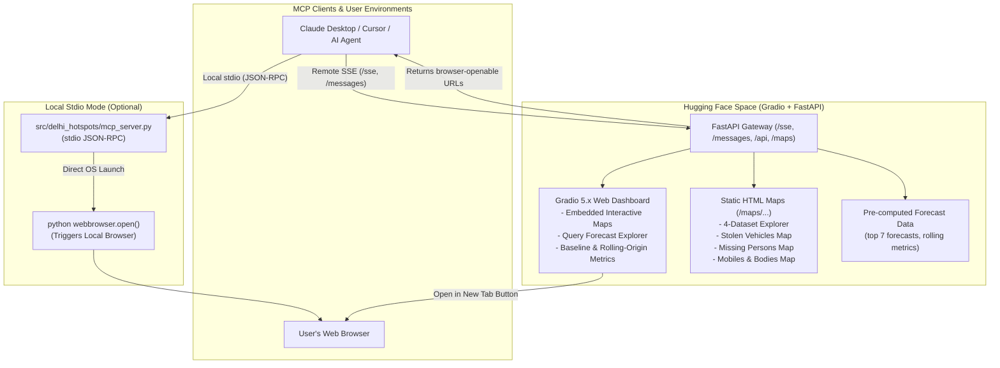

# Hugging Face Space & Model Context Protocol (MCP) Hosting Guide

This guide details the complete design, architecture, and deployment procedures for connecting **DelhiHotspots_ML** to the **Model Context Protocol (MCP)** and hosting it on **Hugging Face Spaces**.

---

## 1. System Architecture & Workflow



---

## 2. Request & Response Facility & Browser Launching

### A. The Core Principle
- **Remote MCP Server (Hosted on Hugging Face)**:
  A remote web server running in a cloud container cannot arbitrarily execute desktop commands like `os.system("open ...")` on a user's remote computer.
  Instead, when an AI client invokes `get_hotspot_map` or `query_hotspots`, the server returns:
  1. A direct, browser-openable URL (`https://<username>-<space-name>.hf.space/maps/four_dataset_hotspot_explorer.html`).
  2. Formatted markdown links (`[Open Interactive Hotspot Map](url)`).
  3. Structured metadata allowing the client to present an actionable link.
- **Local MCP Client Bridge (`src/delhi_hotspots/mcp_server.py`)**:
  When users configure their MCP client (e.g. Claude Desktop) with the local Python script, the tool `get_hotspot_map(open_in_browser=True)` directly calls Python's native `webbrowser.open(map_url)`, automatically popping open the user's default browser window (Chrome, Safari, Firefox, Edge) to the requested map!

---

## 3. Hugging Face Space Structure (`hf_space/`)

The directory [`hf_space/`](file:///Users/abhyuday/Desktop/DelhiHotspots_ML/hf_space) is a self-contained repository ready for direct deployment to Hugging Face:

```
hf_space/
├── README.md               # Hugging Face Space metadata & documentation
├── requirements.txt        # gradio, fastapi, uvicorn, pydantic, pandas
├── app.py                  # Gradio Blocks UI + FastAPI SSE + MCP endpoints
├── maps/                   # Standalone pre-built interactive HTML maps
│   ├── four_dataset_hotspot_explorer.html
│   ├── missing_persons_map.html
│   ├── stolen_vehicles_map.html
│   └── mobiles_and_bodies_map.html
└── data/                   # Aggregated models and reports (No private data)
    ├── four_dataset_forecast_top_seven.csv
    ├── dataset_comparison.json
    ├── rolling_origin_summary.json
    └── model_config.json
```

### Privacy & Data Integrity Verification
- **Zero Raw Person Records**: No files from `data/raw/` or `data/processed/` are included.
- **Administrative Proxies Only**: Geographic coordinates represent police station points, postal PIN centroids, or metro stations.
- **Unlocated Mobiles**: The mobile theft dataset remains non-spatial (timeline only).

---

## 4. MCP Tools & API Specification

### Tool 1: `query_hotspots`
- **Description**: Query top forecast hotspots for Delhi crime and public safety datasets.
- **Arguments**:
  - `dataset` *(optional)*: `'missing_persons'`, `'unidentified_bodies'`, `'stolen_vehicles'`, or `'missing_mobiles'`.
  - `month` *(optional)*: Target forecast month (e.g. `'2026-10'`).
  - `query_text` *(optional)*: Search query string (e.g. `'top hotspots stolen vehicles'`).
- **Returns**: Top 7 ranked locations with coordinates, model scores, confidence, and a browser map link.

### Tool 2: `get_hotspot_map`
- **Description**: Returns browser-openable URLs and map assets.
- **Arguments**:
  - `map_type`: `'four_dataset_explorer'`, `'missing_persons'`, `'stolen_vehicles'`, or `'mobiles_and_bodies'`.
  - `open_in_browser` *(stdio mode)*: Whether to launch default local browser.
- **Returns**: Direct link and status.

### Tool 3: `get_model_metrics`
- **Description**: Compares baseline 80/20 holdout metrics against expanding-window rolling-origin temporal validation.
- **Arguments**:
  - `dataset` *(optional)*: Dataset name or `'all'`.
  - `evaluation_type`: `'all'`, `'baseline'`, or `'rolling'`.

### Tool 4: `list_datasets_and_months`
- **Description**: Lists dataset metadata, spatial capabilities, and available maps.

---

## 5. Deployment Instructions

### Step 1: Create a Space on Hugging Face
1. Log in to [Hugging Face](https://huggingface.co/).
2. Click **New Space** (`https://huggingface.co/new-space`).
3. Set:
   - **Space name**: `delhi-hotspots-ml` (or your preferred name)
   - **License**: `mit`
   - **SDK**: **Gradio**
   - **Space hardware**: `CPU Basic` (Free tier is completely sufficient)
   - **Visibility**: `Public` (or `Private` with an HF token)

### Step 2: Deploy Using the Automated Script
Run the automated deployment script from your terminal:
```bash
./scripts/deploy_to_hf.sh
# Defaults to AbhyudayMishr Oculon
```

### Alternatively: Deploy via Git
```bash
# Clone your new Space repository
git clone https://huggingface.co/spaces/AbhyudayMishr/Oculon /tmp/hf_space_target

# Copy all files from hf_space/
cp -R hf_space/* /tmp/hf_space_target/

# Commit and push
cd /tmp/hf_space_target
git add .
git commit -m "Deploy Oculon Delhi Hotspots ML Gradio explorer and MCP server"
git push origin main
```

---

## 6. Client Setup & Integration

### Claude Desktop
Edit your `claude_desktop_config.json`:
- **macOS**: `~/Library/Application Support/Claude/claude_desktop_config.json`
- **Windows**: `%APPDATA%\Claude\claude_desktop_config.json`

#### Option A: Remote Hugging Face Space (SSE)
```json
{
  "mcpServers": {
    "oculon_delhi_hotspots": {
      "url": "https://abhyudaymishr-oculon.hf.space/sse"
    }
  }
}
```

#### Option B: Local Stdio Bridge (Auto-Opens Browser)
```json
{
  "mcpServers": {
    "oculon_delhi_hotspots_local": {
      "command": "python",
      "args": ["-m", "src.delhi_hotspots.mcp_server"],
      "cwd": "/Users/abhyuday/Desktop/DelhiHotspots_ML"
    }
  }
}
```

### Cursor IDE
1. Open **Cursor Settings** &rarr; **Features** &rarr; **MCP Servers**.
2. Click **+ Add New MCP Server**.
3. Fill in:
   - **Name**: `oculon_delhi_hotspots`
   - **Type**: `SSE`
   - **URL**: `https://abhyudaymishr-oculon.hf.space/sse`
